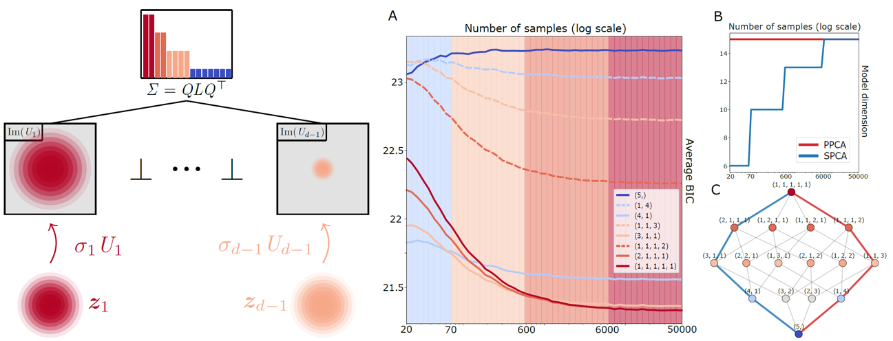

# stratified-pca
Authors' implementation of the preprint [Stratified Principal Component Analysis](https://arxiv.org/abs/2307.15348).



### Abstract
This paper investigates a general family of covariance models with repeated eigenvalues, including in particular probabilistic principal component analysis (PPCA). A geometric interpretation shows that these models are parameterised by flag manifolds and stratify the space of covariance matrices according to the multiplicities of the eigenvalues. The subsequent analysis sheds light on PPCA and allows to answer an important question on the identifiability of sample eigenvalues and eigenvectors. It notably shows that one rarely has enough samples to fit a covariance model with distinct eigenvalues and that block-averaging the adjacent eigenvalues with small gaps achieves a better complexity/goodness-of-fit tradeoff.

### Code
This repository provides the code for reproducing the experiments and figures of the preprint.

### Data
Data for the real experiments was downloaded from the [UC Irvine Machine Learning Repository](https://archive.ics.uci.edu/). 
We used [Glass Identification](https://archive.ics.uci.edu/dataset/42/glass+identification), [Ionosphere](https://archive.ics.uci.edu/dataset/52/ionosphere), [Wine](https://archive.ics.uci.edu/dataset/109/wine) and [Breast Cancer Wisconsin (WDBC)](https://archive.ics.uci.edu/dataset/15/breast+cancer+wisconsin+original).

### Installation
You can create a conda environment and then install the required packages by running the following commands on the Anaconda prompt.
```python
conda create -n stratified-pca python=3.9
pip install -r requirements.txt
```
You may need to install `pygraphviz` for `networkx` graph visualization. If `pip` does not work, you can try running 
```python
conda install -c conda-forge pygraphviz
```

### Citation
```bibtex
@misc{szwagier2023stratified,
      title={Stratified Principal Component Analysis}, 
      author={Tom Szwagier and Xavier Pennec},
      year={2023},
      eprint={2307.15348},
      archivePrefix={arXiv},
      primaryClass={stat.ME}
}
